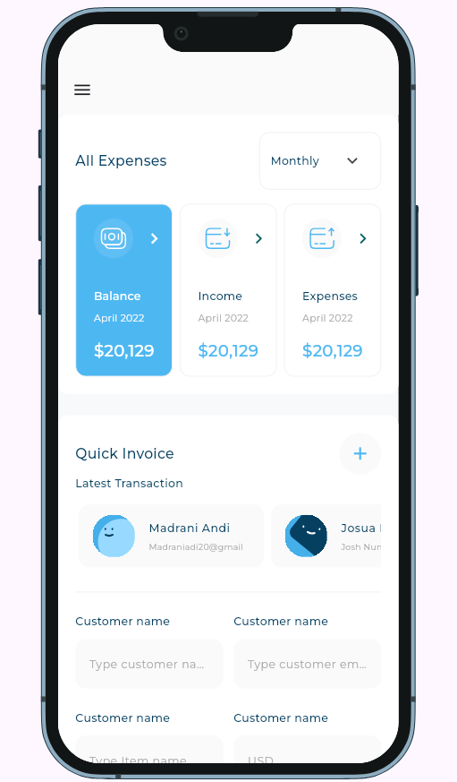
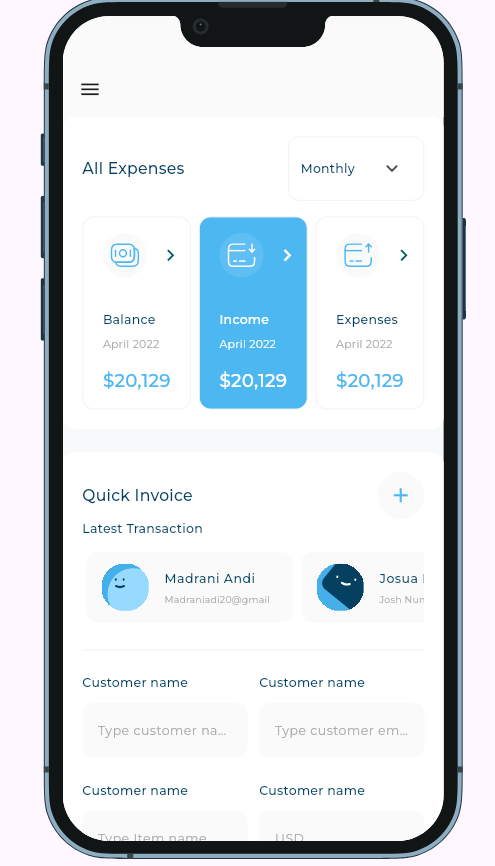
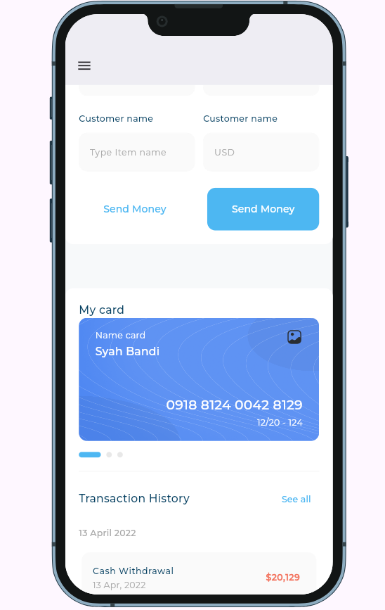
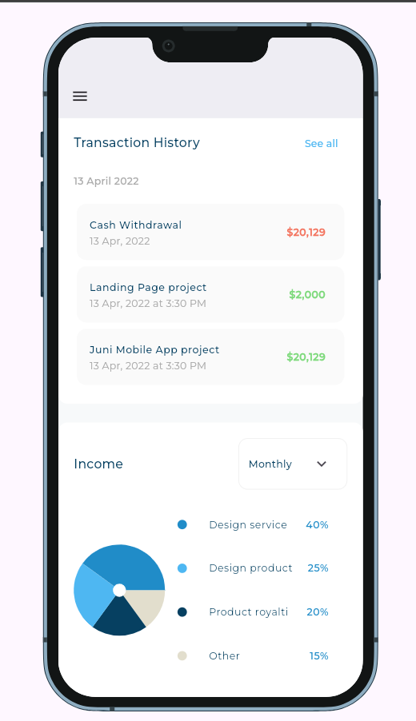
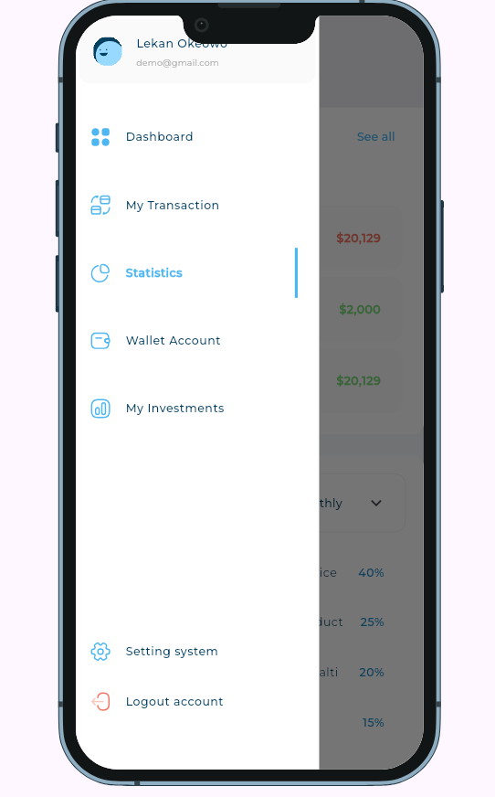
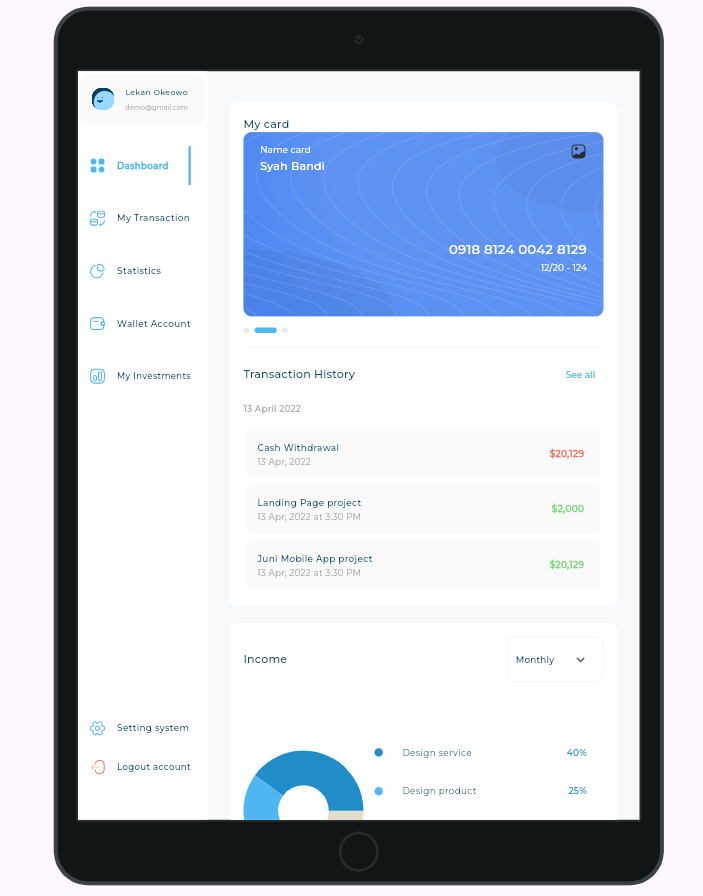
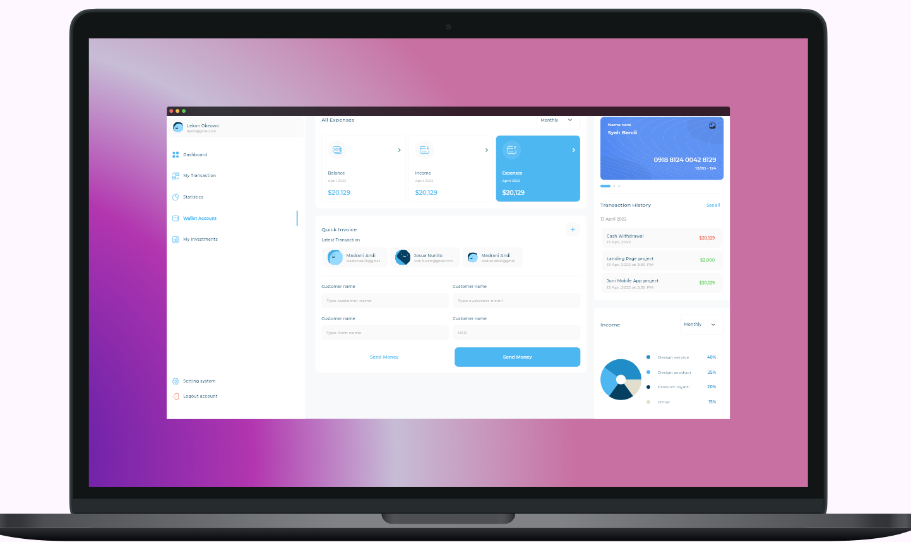
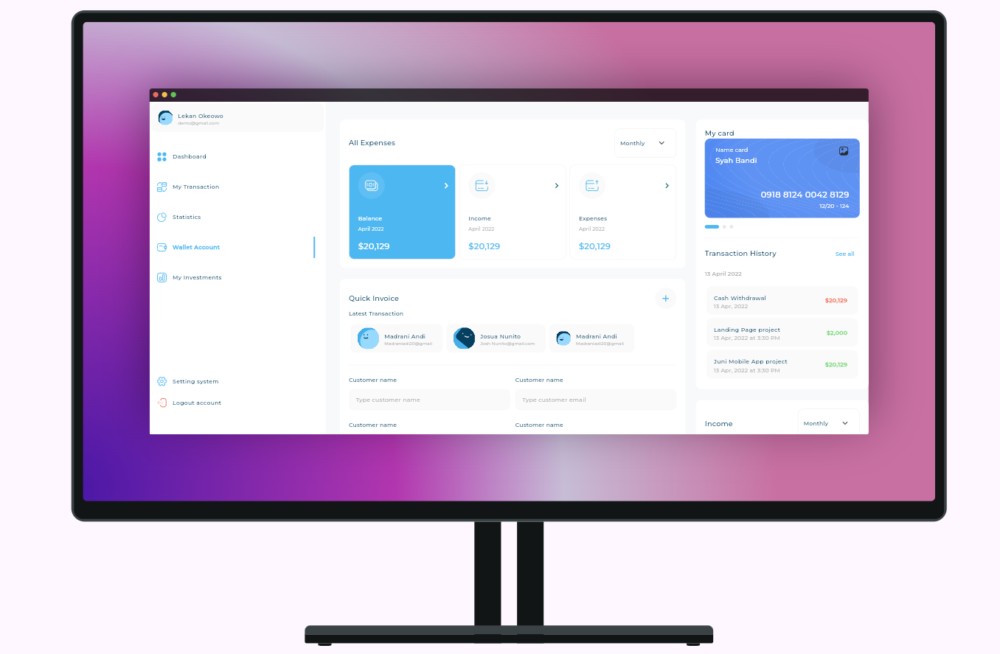
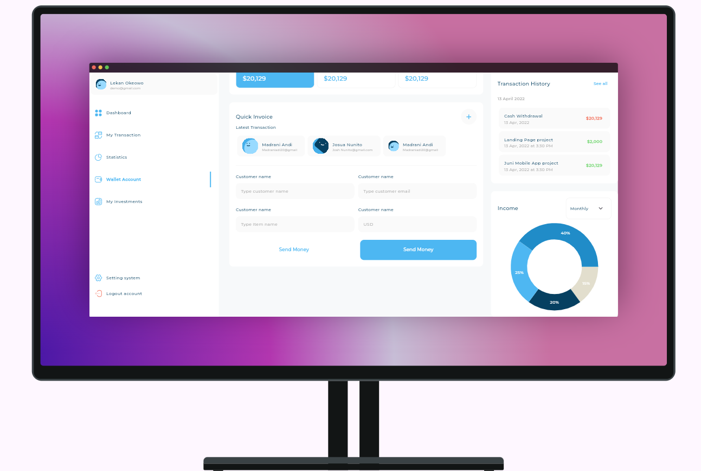
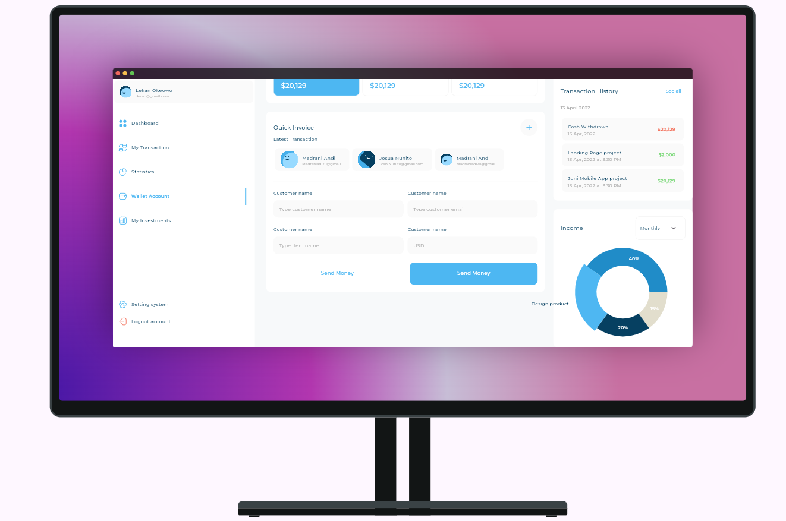

# Responsive Dashboard

A responsive Flutter dashboard application that adapts to different screen sizes (mobile, tablet, and desktop) with a clean, modern UI design. This dashboard features financial management tools including income tracking, expense management, transaction history, and quick invoice creation.

## Features

- **Fully Responsive Design**: Adapts seamlessly to mobile, tablet, and desktop screen sizes
- **Dashboard Overview**: Displays key financial metrics and data visualization
- **Income Tracking**: Visual charts and detailed income information
- **Expense Management**: Track and categorize expenses with filtering options
- **Transaction History**: View and manage all transactions
- **Quick Invoice Creation**: Create invoices quickly with a simple form
- **Card Management**: View and manage digital cards
- **Custom Drawer Navigation**: Intuitive navigation system for different sections

## Screenshots

<div align="center">
  <h3>Mobile, Tablet & Desktop Views</h3>
  
  
  
</div>

<div align="center">
  <h3>Financial Tracking Features</h3>
  
  
  
</div>

<div align="center">
  <h3>Additional Features</h3>
  
  
</div>

<div align="center">
  <h3>Dashboard Details</h3>
  
  
</div>

<div align="center">
  <h3>Complete Dashboard View</h3>
  
</div>

## Technologies Used

- **Flutter**: Cross-platform mobile and web development framework
- **Dart**: Programming language for Flutter applications
- **FL Chart**: For creating beautiful and interactive charts
- **Device Preview**: For testing UI on different device sizes
- **SVG Flutter**: For scalable vector graphics support

## Project Structure

```
lib/
├── models/                 # Data models
│   ├── all_expenses_item_model.dart
│   ├── drawer_item_model.dart
│   ├── income_item_details_model.dart
│   ├── transaction_model.dart
│   └── user_info_model.dart
├── utils/                  # Utility files
│   ├── app_iamges.dart
│   ├── app_styles.dart
│   └── size_config.dart
├── views/                  # Main view files
│   └── dash_board_view.dart
└── widgets/                # Reusable UI components
    ├── adaptive_layout_widget.dart
    ├── dash_board_desktop_layout.dart
    ├── dash_board_mobile_layout.dart
    ├── dash_board_tablet_layout.dart
    ├── custom_drawer.dart
    └── ... (many other UI components)
```

## Getting Started

### Prerequisites

- Flutter SDK (version 3.9.2 or higher)
- Dart SDK (version 3.9.2 or higher)
- Android Studio or VS Code with Flutter plugin

### Installation

1. Clone the repository:
   ```bash
   git clone <repository-url>
   ```

2. Navigate to the project directory:
   ```bash
   cd responsive_dash_board
   ```

3. Get the dependencies:
   ```bash
   flutter pub get
   ```

4. Run the application:
   ```bash
   flutter run
   ```

### For Web Preview

To run the application on web:
```bash
flutter run -d chrome
```

## Responsive Design Approach

The application uses an adaptive layout system that automatically detects screen size and adjusts the UI accordingly:

- **Mobile (< 768px)**: Collapsed navigation with hamburger menu
- **Tablet (768px - 1024px)**: Partially expanded layout with optimized spacing
- **Desktop (> 1024px)**: Full expanded layout with sidebar navigation

## Key Components

- **AdaptiveLayoutWidget**: Main layout component that handles responsive behavior
- **CustomDrawer**: Navigation drawer for mobile and tablet views
- **Dashboard Layouts**: Separate widgets for mobile, tablet, and desktop layouts
- **Chart Components**: Interactive financial data visualization
- **Form Components**: For quick invoice creation and data entry

## Customization

### Colors and Styles
The application uses a consistent color scheme defined in `app_styles.dart`. You can modify the colors by updating the `Color` values in the `AppStyles` class.

### Typography
All text styles use the Montserrat font with responsive sizing. The font scaling is handled automatically based on screen size.

## Assets

The project includes:
- SVG icons for scalable vector graphics
- Custom fonts (Montserrat family)
- Background images for cards
- Screenshot images for documentation

## Testing

To run tests:
```bash
flutter test
```

## Building for Production

To build for Android:
```bash
flutter build apk --release
```

To build for iOS:
```bash
flutter build ios --release
```

To build for Web:
```bash
flutter build web
```

## Contributing

1. Fork the repository
2. Create a feature branch (`git checkout -b feature/AmazingFeature`)
3. Commit your changes (`git commit -m 'Add some AmazingFeature'`)
4. Push to the branch (`git push origin feature/AmazingFeature`)
5. Open a Pull Request

## License

This project is licensed under the MIT License - see the [LICENSE](LICENSE) file for details.

## Acknowledgments

- Thanks to the Flutter team for the amazing framework
- FL Chart package for beautiful data visualization
- Device Preview for testing on multiple device sizes